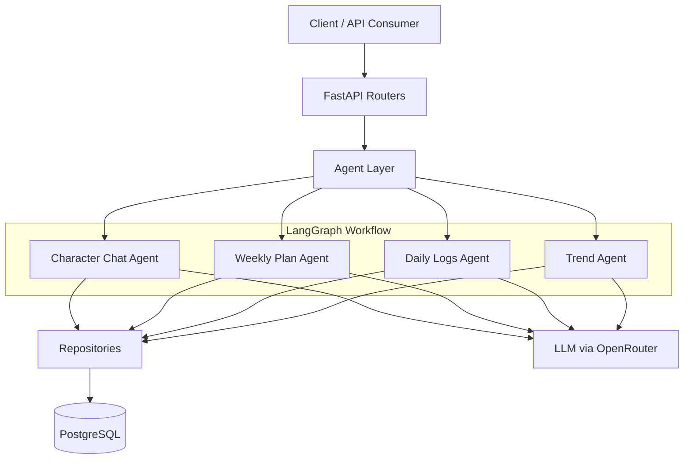
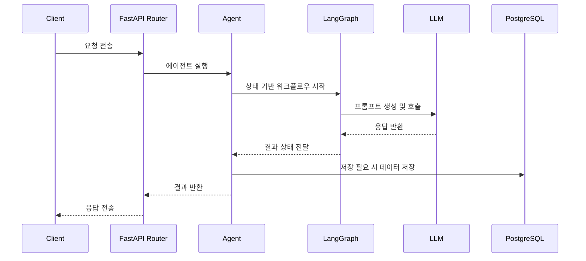

# Blue Pill Agent Server

Blue Pill Agent Server는 FastAPI와 LangGraph를 기반으로 동작하는 AI 에이전트 서버입니다. 사용자의 요청에 따라 캐릭터 기반 대화, 주간 계획 생성, 일일 로그 생성, 트렌드 분석을 수행하고 결과를 PostgreSQL에 저장합니다.

이 프로젝트는 단순한 API 서버가 아니라, 여러 LLM 기반 에이전트를 조합해 복합적인 콘텐츠 생성 파이프라인을 실행하는 형태로 구성되어 있습니다.

## 1. 프로젝트 목표

이 서버의 핵심 목표는 다음과 같습니다.

- 캐릭터 설정에 맞춘 대화 응답 생성
- 주간 단위의 계획 자동 생성
- 시간대별 일일 로그 생성
- 트렌드 수집 및 요약 생성
- 생성된 결과를 데이터베이스에 영속화

즉, “캐릭터가 행동하는 것처럼 보이는 AI 워크플로우”를 구현하는 것이 이 프로젝트의 중심입니다.

## 2. 기술 스택

- Python 3.14+
- FastAPI
- LangGraph
- LangChain OpenRouter
- PostgreSQL + psycopg
- Pydantic
- Boto3 / BeautifulSoup 등 보조 라이브러리

## 3. 전체 아키텍처 개요

프로젝트는 크게 다음 4계층으로 나누어 이해하면 쉽습니다.

### 3.1 비전(Vision)

이 프로젝트는 단순한 챗봇이 아니라, 캐릭터 기반의 자율적인 콘텐츠 생성 시스템을 지향합니다.

- 사용자의 상황과 관계 맥락을 반영한 대화
- 일정과 트렌드를 바탕으로 한 주간/일간 콘텐츠 생성
- 생성된 결과를 데이터베이스에 지속적으로 저장
- 이후 다른 에이전트나 서비스에서 재사용 가능한 형태로 가공

즉, “한 명의 캐릭터가 일상을 기록하고, 대화하고, 계획을 세우는 AI 에이전트”를 구현하는 것이 목표입니다.

### 3.2 아키텍처 다이어그램



### 3.3 실행 흐름 다이어그램



1. API 계층
   - 요청을 받아 적절한 에이전트를 실행하는 진입점입니다.
   - [api/routers](api/routers) 아래에서 엔드포인트를 관리합니다.

2. Agent 계층
   - 실제 비즈니스 로직과 LLM 워크플로우를 담당합니다.
   - [agents](agents) 아래에서 각 에이전트가 정의됩니다.

3. Domain / Repository 계층
   - DB 접근 로직을 담당합니다.
   - [domains](domains) 아래의 Repository들이 PostgreSQL에 직접 접근합니다.

4. Common 계층
   - LLM 설정, DB 연결, 날짜 유틸 등 공통 기능을 담당합니다.
   - [common](common) 아래에 모듈이 위치합니다.

## 4. 실행 흐름

### 4.1 서버 부팅

애플리케이션 시작 시 [api/main.py](api/main.py)에서 다음 작업이 수행됩니다.

- DB 풀 생성
- Postgres 기반 Store / Checkpointer 초기화
- 각 Agent 인스턴스 생성
- 각 Agent의 LangGraph 그래프 컴파일
- FastAPI 라우터 등록

이 과정이 끝나면 서버는 다음 네 가지 기능을 사용할 수 있는 상태가 됩니다.

- 트렌드 생성
- 주간 계획 생성
- 일일 로그 생성
- 캐릭터 채팅

### 4.2 요청 처리 방식

예를 들어 캐릭터 채팅 요청이 들어오면 다음 흐름으로 처리됩니다.

1. 클라이언트가 API로 요청 전송
2. 라우터가 해당 에이전트를 호출
3. 에이전트가 컨텍스트를 생성
4. LangGraph 그래프가 노드별로 실행
5. LLM 응답 생성
6. 결과를 반환하고 필요 시 DB에 저장

## 5. 디렉터리 구조 설명

```text
agent-server/
├── api/
│   ├── main.py
│   ├── routers/
│   └── schemas/
├── agents/
│   ├── base.py
│   ├── character_chat_agent/
│   ├── daily_logs_agent/
│   ├── subgraphs/
│   ├── trend_agent/
│   └── weekly_plan_agent/
├── common/
│   ├── db/
│   ├── llm/
│   └── utils/
├── domains/
│   ├── daily_plan/
│   ├── hourly_log/
│   ├── log_room_member/
│   └── trend/
├── pyproject.toml
└── README.md
```

### 주요 디렉터리

#### api/

HTTP 요청을 받아 에이전트를 실행하는 진입점입니다.

- [api/main.py](api/main.py)
  - FastAPI 앱 생성 및 lifespan 설정
  - DB/에이전트 초기화
  - 라우터 등록

- [api/routers](api/routers)
  - `/chat`, `/weekly-plan`, `/daily-logs`, `/trend` 같은 엔드포인트 구현

- [api/schemas](api/schemas)
  - 요청/응답 모델 정의

#### agents/

실제 AI 워크플로우가 구현되는 핵심 영역입니다.

- [agents/base.py](agents/base.py)
  - 모든 에이전트가 공통으로 사용하는 기본 클래스
  - LangGraph 그래프를 컴파일하고 invoke하는 역할

- [agents/character_chat_agent](agents/character_chat_agent)
  - 캐릭터 기반 대화 생성
  - 답변 생성 후 장기 기억 저장 여부를 판단

- [agents/daily_logs_agent](agents/daily_logs_agent)
  - 하루 일과를 시간대별로 생성하는 에이전트
  - 하위 서브그래프를 조합해 계획, 텍스트, 이미지 생성까지 처리

- [agents/trend_agent](agents/trend_agent)
  - 트렌드 검색, 필터링, 스크래핑, 요약 결과 생성

- [agents/weekly_plan_agent](agents/weekly_plan_agent)
  - 월간 트렌드와 캐릭터 설정을 바탕으로 주간 계획 생성

- [agents/subgraphs](agents/subgraphs)
  - 반복적으로 재사용되는 작은 그래프들을 모아둔 서브시스템
  - 시간대별 계획, 로그 텍스트, 이미지 생성에 사용

#### common/

공통 기능을 모아둔 계층입니다.

- [common/llm](common/llm)
  - LLM 모델 설정 및 OpenRouter 연결
  - 현재는 Gemini Flash Lite 모델을 사용하도록 설정되어 있음

- [common/db](common/db)
  - PostgreSQL 연결 관리

- [common/utils](common/utils)
  - 날짜 계산, 공통 유틸리티 처리

#### domains/

데이터베이스 접근 로직을 담당하는 Repository 계층입니다.

- [domains/log_room_member/repository.py](domains/log_room_member/repository.py)
  - 캐릭터 프롬프트 및 관계 정보 조회

- [domains/daily_plan/repository.py](domains/daily_plan/repository.py)
  - 주간/일간 계획 저장 및 조회

- [domains/hourly_log/repository.py](domains/hourly_log/repository.py)
  - 시간대별 로그 저장

- [domains/trend/repository.py](domains/trend/repository.py)
  - 트렌드 데이터 저장 및 조회

## 6. 주요 에이전트별 역할

### Character Chat Agent

캐릭터 기반의 대화 응답을 생성합니다.

- 사용자와 캐릭터의 관계 정보 사용
- 캐릭터 설정 프롬프트 반영
- 최근 대화가 기억 저장 가치가 있는지 평가
- 필요 시 장기 기억 저장

### Weekly Plan Agent

이번 주의 일별 계획을 생성합니다.

- 현재 월/날짜 기준으로 주간 날짜 계산
- 트렌드 데이터를 참고해 계획 구성
- 캐릭터 프롬프트를 반영해 컨텍스트 맞춤형 계획 생성

### Daily Logs Agent

하루를 시간대별로 나눠 로그를 생성합니다.

- 시간대별 계획 생성
- 로그 텍스트 생성
- 이미지 생성까지 파이프라인 연결
- 생성 결과를 저장

### Trend Agent

트렌드 데이터를 수집하고 구조화합니다.

- 검색 결과 수집
- 필터링
- 스크래핑
- 요약된 트렌드 객체 생성

## 7. API 엔드포인트

현재 프로젝트는 아래 API를 제공합니다.

- `POST /chat`
  - 캐릭터 채팅 실행

- `POST /weekly-plan/run`
  - 주간 계획 생성 실행

- `POST /daily-logs/run`
  - 일일 로그 생성 실행

- `POST /trend/run`
  - 트렌드 생성 실행

- `GET /health`
  - 서버 상태 확인

## 8. 환경 변수

실행 전에 아래 환경 변수를 설정해야 합니다.

- `OPENROUTER_API_KEY`
  - LLM 호출에 필요

- `DB_URL`
  - PostgreSQL 연결 정보

## 9. 로컬 실행 방법

### 의존성 설치

```bash
uv sync
```

### 실행

```bash
fastapi dev api/main.py
```

실행 후 브라우저나 API 클라이언트에서 다음과 같이 확인할 수 있습니다.

```bash
curl http://127.0.0.1:8000/health
```

## 10. 개발자에게 중요한 포인트

이 프로젝트를 이해할 때 가장 중요한 점은 다음 두 가지입니다.

1. 모든 기능이 단일 API가 아니라 LangGraph 기반 워크플로우로 구현되어 있다는 점
2. 각 에이전트가 독립적으로 존재하지만, 공통 컨텍스트와 저장소를 공유한다는 점

즉, 이 코드는 “에이전트 기반 콘텐츠 생성 시스템”으로 보는 것이 가장 자연스럽습니다.

## 11. 현재 구현 상태

현재 코드베이스는 기본 구조와 핵심 워크플로우가 잘 정리되어 있으며, 일부 Repository나 세부 구현은 아직 보완이 필요한 상태입니다. 특히 다음 부분은 개발 중이거나 TODO로 남아 있을 수 있습니다.

- 일부 Repository 구현의 세부 로직
- 데이터 모델의 세밀한 정규화
- 에러 처리와 예외 케이스 보강

## 12. 참고

개발할 때는 다음 순서로 읽으면 이해가 빠릅니다.

1. [api/main.py](api/main.py)
2. [agents/base.py](agents/base.py)
3. 각 에이전트의 `agent.py`와 `graph.py`
4. 해당 에이전트의 `state.py`와 `nodes`
5. Repository 계층
